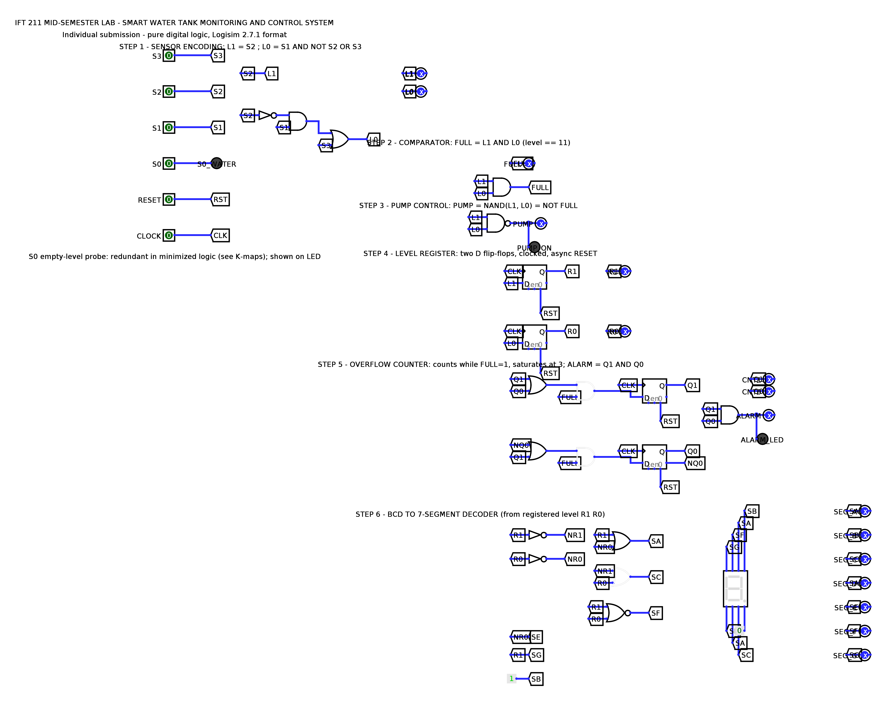

# IFT 211 — Mid-Semester Lab Assessment

## Smart Water Tank Monitoring & Control System

| | |
|---|---|
| **Course** | IFT 211 — Digital Logic Design |
| **Project** | Smart Water Tank Monitoring & Control System |
| **Submission type** | **Individual submission** |
| **Student name** | ______________________________ |
| **Matric number** | ______________________________ |
| **Simulator used** | Logisim 2.7.1 (file also opens in Logisim Evolution) |
| **Circuit file** | `circuit/water_tank.circ` |

> Design constraint honoured throughout: **pure digital logic only** — logic gates,
> D flip-flops, and wiring. No microcontrollers, no abstract black-box blocks.

---

## Table of Contents

1. [System Overview and Block Diagram](#1-system-overview-and-block-diagram)
2. [Step 1 — Sensor Encoding (Combinational Logic)](#2-step-1--sensor-encoding)
3. [Step 2 — Comparator (Full Detection)](#3-step-2--comparator-full-detection)
4. [Step 3 — Pump Control Logic](#4-step-3--pump-control-logic)
5. [Step 4 — Register (Level Memory)](#5-step-4--register-level-memory)
6. [Step 5 — Overflow Counter and Alarm](#6-step-5--overflow-counter-and-alarm)
7. [Step 6 — 7-Segment Display Decoder](#7-step-6--7-segment-display-decoder)
8. [Boolean Derivations — Summary](#8-boolean-derivations--summary)
9. [Testing Scenarios and Simulation Results](#9-testing-scenarios-and-simulation-results)
10. [System Explanation and Lab-Concept Mapping](#10-system-explanation-and-lab-concept-mapping)
11. [How to Open and Run the Circuit](#11-how-to-open-and-run-the-circuit)

---

## 1. System Overview and Block Diagram

A residential or industrial water tank must monitor its water level, indicate
LOW / MEDIUM / FULL, stop filling automatically when full, display the level
visually, and raise an alarm when there is an overflow risk. The system inputs
are four water-level sensors plus CLOCK and RESET:

| Sensor | Meaning | Mounted at |
|--------|---------------------|------------|
| S0 | Empty-level probe | tank bottom |
| S1 | 25 % probe | quarter height |
| S2 | 50 % probe | half height |
| S3 | 100 % probe (Full) | tank top |

A sensor outputs logic 1 while water covers it, so a physically consistent
reading is **thermometer-coded**: if a higher sensor is wet, every sensor below
it is wet too. The five valid readings are:

| Water level | S3 S2 S1 S0 | Level name |
|-------------|-------------|------------|
| Dry tank | 0 0 0 0 | Empty (00) |
| Below 25 % | 0 0 0 1 | Empty (00) |
| 25 % | 0 0 1 1 | 25 % (01) |
| 50 % | 0 1 1 1 | 50 % (10) |
| 100 % | 1 1 1 1 | Full (11) |

All other 11 input combinations are physically impossible (non-thermometer)
codes; Section 2 shows how they are used as don't-cares and Section 9 shows how
the built circuit actually responds to them.

The implemented signal flow matches the block diagram required by the brief:

```
        Sensors (S0–S3)
              |
              v
      +----------------+
      | Encoding Logic |            STEP 1
      +----------------+
              |
              v
        Level (L1 L0)
       /      |       \
      v       v        v
 Pump Logic  Register  Comparator   STEPS 3, 4, 2
   (NAND)    (2x D-FF)  (FULL=L1·L0)
      |       |            |
      v       |            v
   PUMP pin   |     Overflow Counter  STEP 5
   + LED      |            |
              |            v
              |          ALARM (Q1·Q0) + LED
              v
      BCD → 7-Segment Decoder        STEP 6
              |
              v
      7-Segment Display (0–3)
```

CLOCK drives the register and counter flip-flops; RESET asynchronously clears
all four flip-flops.

### 1.1 The implemented circuit

The screenshot below is the actual `water_tank.circ` as built in Logisim. Each
of the six stages is labelled on the canvas, matching the steps described in
Sections 2–7. Inputs (S0–S3, RESET, CLOCK) are on the left; nets are carried
between stages by named tunnels; outputs drive status LEDs and the 7-segment
display.



---

## 2. Step 1 — Sensor Encoding

**Goal:** convert the four sensor bits into the 2-bit level code
`L1 L0` ∈ {00 Empty, 01 25 %, 10 50 %, 11 Full}.

### 2.1 Truth table (with don't-cares)

`m` is the minterm number of `S3 S2 S1 S0`. Valid thermometer rows are marked;
every impossible row is a don't-care (×) that the K-maps may exploit.

| m | S3 | S2 | S1 | S0 | Valid? | L1 | L0 | Level |
|---|----|----|----|----|--------|----|----|-------|
| 0 | 0 | 0 | 0 | 0 | yes | 0 | 0 | Empty |
| 1 | 0 | 0 | 0 | 1 | yes | 0 | 0 | Empty |
| 2 | 0 | 0 | 1 | 0 | no | × | × | — |
| 3 | 0 | 0 | 1 | 1 | yes | 0 | 1 | 25 % |
| 4 | 0 | 1 | 0 | 0 | no | × | × | — |
| 5 | 0 | 1 | 0 | 1 | no | × | × | — |
| 6 | 0 | 1 | 1 | 0 | no | × | × | — |
| 7 | 0 | 1 | 1 | 1 | yes | 1 | 0 | 50 % |
| 8 | 1 | 0 | 0 | 0 | no | × | × | — |
| 9 | 1 | 0 | 0 | 1 | no | × | × | — |
| 10 | 1 | 0 | 1 | 0 | no | × | × | — |
| 11 | 1 | 0 | 1 | 1 | no | × | × | — |
| 12 | 1 | 1 | 0 | 0 | no | × | × | — |
| 13 | 1 | 1 | 0 | 1 | no | × | × | — |
| 14 | 1 | 1 | 1 | 0 | no | × | × | — |
| 15 | 1 | 1 | 1 | 1 | yes | 1 | 1 | Full |

### 2.2 K-map for L1

Ones at m7, m15; zeros at m0, m1, m3; all other cells ×.

| S3S2 \ S1S0 | 00 | 01 | 11 | 10 |
|-------------|----|----|----|----|
| **00** | 0 | 0 | 0 | × |
| **01** | × | × | **1** | × |
| **11** | × | × | **1** | × |
| **10** | × | × | × | × |

**Grouping:** one 8-cell group covering the two middle rows (all cells with
S2 = 1). The group contains both 1s and only don't-cares otherwise, and no 0.

**Result:**

> **L1 = S2**

### 2.3 K-map for L0

Ones at m3, m15; zeros at m0, m1, m7; all other cells ×.

| S3S2 \ S1S0 | 00 | 01 | 11 | 10 |
|-------------|----|----|----|----|
| **00** | 0 | 0 | **1** | × |
| **01** | × | × | 0 | × |
| **11** | × | × | **1** | × |
| **10** | × | × | × | × |

**Groupings:**
1. 4-cell group: rows 00 and 10, columns 11 and 10 → all cells with
   S2 = 0 AND S1 = 1 → term **S1·S̄2** (covers m3; avoids the 0 at m7).
2. 8-cell group: bottom two rows (S3 = 1) → term **S3** (covers m15; m7 has
   S3 = 0 so the 0 is not touched).

**Result:**

> **L0 = S1·S̄2 + S3**

### 2.4 Gate implementation and S0

The encoder is built exactly from these minimized expressions using
OR/AND/NOT gates, as the brief requires:

- `L1 = S2` — direct connection (the K-map reduces it to a single literal).
- `L0 = (S1 AND (NOT S2)) OR S3` — one NOT, one AND, one OR gate.

The K-maps eliminate **S0** entirely: whenever S0 alone is wet the level is
still "Empty" (00), and in every higher valid state S0 is implied by the
thermometer property. S0 is therefore wired to an indicator LED
(`S0_WATER`) in the circuit so the input is still observable, and this
redundancy is stated explicitly rather than hidden.

**Invalid-code behaviour (design decision):** because invalid codes were used
as don't-cares, a faulty sensor pattern maps deterministically through
L1 = S2, L0 = S1·S̄2 + S3. For example `0100` (S2 stuck alone) reads as level
10 (50 %), and `1000` (S3 stuck alone) reads as level 01 (25 %). The system
never crashes or produces an undefined display for any of the 16 input codes —
Section 9 verifies all 16 exhaustively in simulation.

---

## 3. Step 2 — Comparator (Full Detection)

The comparator detects `LEVEL = 11` by comparing the level code against the
constant 11 — for a 2-bit equality against a constant of all-ones this reduces
to a single AND gate:

| L1 | L0 | FULL |
|----|----|------|
| 0 | 0 | 0 |
| 0 | 1 | 0 |
| 1 | 0 | 0 |
| 1 | 1 | **1** |

> **FULL = L1 · L0**

Implemented with one 2-input AND gate. FULL feeds the overflow counter
(Step 5) and is also brought out on the `FULL` output pin.

---

## 4. Step 3 — Pump Control Logic

Requirement: pump ON while the tank is below full, pump OFF at full.

> **PUMP = NOT(FULL) = NOT(L1 · L0) = NAND(L1, L0)**

Implemented as a single 2-input **NAND** gate (the brief allows NAND or
AND + NOT; NAND uses one gate instead of two).

| L1 | L0 | Level | PUMP |
|----|----|----------|------|
| 0 | 0 | Empty | 1 (ON) |
| 0 | 1 | 25 % | 1 (ON) |
| 1 | 0 | 50 % | 1 (ON) |
| 1 | 1 | Full | **0 (OFF)** |

The `PUMP_ON` LED in the circuit lights while the pump runs. Because PUMP is
purely combinational on L1 L0, the pump reacts immediately when the FULL
condition appears or clears — no clock edge is needed to stop filling.

---

## 5. Step 4 — Register (Level Memory)

Two positive-edge-triggered **D flip-flops** form a 2-bit register that stores
the last valid tank level:

- `FF_R1`: D input = L1, output = R1
- `FF_R0`: D input = L0, output = R0
- Both clock inputs are driven by **CLOCK**; on each rising edge the register
  captures the current level code (R1 R0 ← L1 L0).
- Both asynchronous **clear** inputs are driven by **RESET**; asserting RESET
  forces R1 R0 = 00 immediately, independent of the clock.

Characteristic behaviour of each D flip-flop: `Q(next) = D` on the rising
clock edge; Q holds its value between edges. This is what makes the display
stable: the 7-segment digit only changes on a clock edge, even if the sensor
inputs bounce between edges.

*Lab concepts applied: flip-flops, registers, clocking principles.*

---

## 6. Step 5 — Overflow Counter and Alarm

Requirement: trigger the alarm if FULL remains high for **3 clock cycles**;
the counter must reset when FULL = 0.

### 6.1 State design

A 2-bit synchronous counter (`Q1 Q0`) built from two D flip-flops counts
rising clock edges **only while FULL = 1**. It counts 00 → 01 → 10 → 11 and
then **saturates at 11** (it holds 3 rather than wrapping to 0, so the alarm
stays on while the overflow risk persists). When FULL = 0 the next-state
logic forces 00 on the next edge, and RESET clears the counter asynchronously.

State table (`Q1+ Q0+` = next state on a rising clock edge):

| FULL | Q1 | Q0 | Q1+ | Q0+ | Comment |
|------|----|----|-----|-----|---------------------|
| 0 | × | × | 0 | 0 | counter cleared |
| 1 | 0 | 0 | 0 | 1 | first full cycle |
| 1 | 0 | 1 | 1 | 0 | second full cycle |
| 1 | 1 | 0 | 1 | 1 | third → alarm |
| 1 | 1 | 1 | 1 | 1 | saturate, alarm held |

### 6.2 Next-state derivation (D inputs)

For D flip-flops, `D1 = Q1+` and `D0 = Q0+`. K-maps over (FULL, Q1, Q0):

`D1` — ones at (1,0,1), (1,1,0), (1,1,1):

| FULL \ Q1Q0 | 00 | 01 | 11 | 10 |
|-------------|----|----|----|----|
| **0** | 0 | 0 | 0 | 0 |
| **1** | 0 | **1** | **1** | **1** |

Grouping: pair {FULL·Q0 columns 01,11} + pair {FULL·Q1 columns 11,10}:

> **D1 = FULL·(Q1 + Q0)**

`D0` — ones at (1,0,0), (1,1,0), (1,1,1):

| FULL \ Q1Q0 | 00 | 01 | 11 | 10 |
|-------------|----|----|----|----|
| **0** | 0 | 0 | 0 | 0 |
| **1** | **1** | 0 | **1** | **1** |

Grouping: pair {FULL·Q̄0 columns 00,10} + pair {FULL·Q1 columns 11,10}:

> **D0 = FULL·(Q1 + Q̄0)**

Q̄0 is taken directly from the flip-flop's complementary output, so no extra
inverter is needed. Each D input costs one OR and one AND gate. Both
flip-flops share CLOCK — the counter is fully **synchronous**.

### 6.3 Alarm

> **ALARM = Q1 · Q0**

One AND gate. The counter reaches 11 on the **third** consecutive rising
clock edge with FULL = 1, exactly as required, and the `ALARM_LED` lights.
Both counter flip-flops are also cleared asynchronously by RESET.

*Lab concepts applied: counters, sequential logic.*

---

## 7. Step 6 — 7-Segment Display Decoder

The registered level `R1 R0` (a 2-bit BCD value 0–3) drives a gate-built
BCD-to-7-segment decoder. Segment naming is the standard a (top) … g (middle),
active-high:

| R1 | R0 | Digit | a | b | c | d | e | f | g |
|----|----|-------|---|---|---|---|---|---|---|
| 0 | 0 | 0 | 1 | 1 | 1 | 1 | 1 | 1 | 0 |
| 0 | 1 | 1 | 0 | 1 | 1 | 0 | 0 | 0 | 0 |
| 1 | 0 | 2 | 1 | 1 | 0 | 1 | 1 | 0 | 1 |
| 1 | 1 | 3 | 1 | 1 | 1 | 1 | 0 | 0 | 1 |

With only two variables each K-map is a 2×2 grid; reading the groups gives:

| Segment | K-map cells that are 1 | Minimized expression | Gates used |
|---------|------------------------|----------------------|------------|
| a | 00, 10, 11 | **a = R1 + R̄0** | OR (+ shared NOT) |
| b | all | **b = 1** | constant 1 |
| c | 00, 01, 11 | **c = R̄1 + R0** | OR (+ shared NOT) |
| d | 00, 10, 11 | **d = a = R1 + R̄0** | reuse of segment a |
| e | 00, 10 | **e = R̄0** | shared NOT |
| f | 00 | **f = R̄1·R̄0 = NOR(R1, R0)** | NOR |
| g | 10, 11 | **g = R1** | wire |

Only two inverters (R̄1, R̄0) are needed and they are shared across segments;
d reuses the segment-a signal because their columns are identical. The seven
signals drive Logisim's 7-segment display component and are also brought out
on pins `SEG_A … SEG_G` so the decoder can be verified in the truth table.

*Lab concepts applied: encoders/decoders, display interfacing.*

---

## 8. Boolean Derivations — Summary

Step-by-step, from requirement to final gate-level form:

**L1** (level MSB)
1. Requirement: L1 = 1 for levels 10 and 50 %/Full rows → minterms m7, m15.
2. K-map with 11 don't-cares (Section 2.2) → single 8-cell group S2 = 1.
3. **L1 = S2.**

**L0** (level LSB)
1. Requirement: L0 = 1 for 25 % and Full rows → minterms m3, m15.
2. K-map (Section 2.3) → groups S1·S̄2 and S3.
3. **L0 = S1·S̄2 + S3** — implemented as `(S1 AND NOT S2) OR S3`.

**FULL**
1. Equality comparison LEVEL = 11₂ → both bits must be 1.
2. **FULL = L1·L0** — one AND gate.

**PUMP**
1. Requirement: ON below full, OFF at full → PUMP = F̄ULL.
2. PUMP = NOT(L1·L0) — by De Morgan equivalent to L̄1 + L̄0.
3. **PUMP = NAND(L1, L0)** — one gate.

**ALARM**
1. Count consecutive FULL cycles with a 2-bit synchronous counter.
2. Next-state K-maps (Section 6.2): **D1 = FULL·(Q1+Q0)**,
   **D0 = FULL·(Q1+Q̄0)**.
3. Alarm when count = 11₂ → **ALARM = Q1·Q0.**

Every expression above is implemented literally, gate for gate, in
`water_tank.circ`, and the simulation results in Section 9 confirm each one.

---

## 9. Testing Scenarios and Simulation Results

**Method.** The delivered `water_tank.circ` was simulated headlessly with the
real Logisim 2.7.1 engine using the included test harness
(`verification/TableDriver.java`), which drives the input pins with scripted
vectors and records every output pin after propagation. The observed values
were compared bit-for-bit against an independent reference model
(`verification/verify.py`). **Result: 71 test steps, 0 mismatches.** The full
machine-generated table is in `verification/verification_log.md`; the
scenarios below are extracts from that run, so every "Observed" entry is a
real simulation result, not a prediction.

### 9.1 Exhaustive encoder / comparator / pump sweep

All 16 sensor codes were applied and clocked. Valid rows shown first:

| S3 S2 S1 S0 | Kind | L1 L0 | FULL | PUMP | Digit shown | Expected | Observed |
|-------------|---------|-------|------|------|-------------|----------|----------|
| 0 0 0 0 | valid | 0 0 | 0 | 1 | 0 | same | ✔ match |
| 0 0 0 1 | valid | 0 0 | 0 | 1 | 0 | same | ✔ match |
| 0 0 1 1 | valid | 0 1 | 0 | 1 | 1 | same | ✔ match |
| 0 1 1 1 | valid | 1 0 | 0 | 1 | 2 | same | ✔ match |
| 1 1 1 1 | valid | 1 1 | **1** | **0** | 3 | same | ✔ match |
| 0 0 1 0 | invalid | 0 1 | 0 | 1 | 1 | same | ✔ match |
| 0 1 0 0 | invalid | 1 0 | 0 | 1 | 2 | same | ✔ match |
| 0 1 0 1 | invalid | 1 0 | 0 | 1 | 2 | same | ✔ match |
| 0 1 1 0 | invalid | 1 0 | 0 | 1 | 2 | same | ✔ match |
| 1 0 0 0 | invalid | 0 1 | 0 | 1 | 1 | same | ✔ match |
| 1 0 0 1 | invalid | 0 1 | 0 | 1 | 1 | same | ✔ match |
| 1 0 1 0 | invalid | 0 1 | 0 | 1 | 1 | same | ✔ match |
| 1 0 1 1 | invalid | 0 1 | 0 | 1 | 1 | same | ✔ match |
| 1 1 0 0 | invalid | 1 1 | 1 | 0 | 3 | same | ✔ match |
| 1 1 0 1 | invalid | 1 1 | 1 | 0 | 3 | same | ✔ match |
| 1 1 1 0 | invalid | 1 1 | 1 | 0 | 3 | same | ✔ match |

Every invalid (non-thermometer) code resolves to a defined level with no
undefined outputs, as designed in Section 2.4.

### 9.2 Operational scenario (sequential behaviour)

Each row is one simulation step; "edge" marks a rising CLOCK edge.

| # | Scenario | Inputs (S3S2S1S0, RESET, CLOCK) | Expected | Observed |
|---|----------|-------------------------------|----------|----------|
| B1 | Power-on reset | 0000, R=1, clock pulsed | Register 00, counter 00, digit 0, alarm off | ✔ match |
| B2 | Empty tank, clock edge | 0000, R=0, edge | Stores 00, digit **0**, PUMP **ON** | ✔ match |
| B3 | Water at S0 only | 0001, edge | Still level 00, digit 0 | ✔ match |
| B4 | 25 % reached | 0011, edge | Stores 01, digit **1**, pump ON | ✔ match |
| B5 | 50 % reached | 0111, edge | Stores 10, digit **2**, pump ON | ✔ match |
| B6 | Tank FULL (pump ON→OFF) | 1111, edge 1 | FULL=1, **PUMP OFF instantly**, digit 3, counter 01 | ✔ match |
| B7 | FULL held, 2nd cycle | 1111, edge 2 | Counter 10, alarm still off | ✔ match |
| B8 | FULL held, 3rd cycle | 1111, edge 3 | Counter 11 → **ALARM ON** | ✔ match |
| B9 | FULL held, 4th cycle | 1111, edge 4 | Counter saturates at 11, alarm stays ON | ✔ match |
| B10 | Drained to 50 % (pump OFF→ON) | 0111, edge | FULL=0, **PUMP ON instantly**, counter clears 00, alarm OFF, digit 2 | ✔ match |
| B11 | Drained to 25 % | 0011, edge | Stores 01, digit 1 | ✔ match |
| B12 | Refill to FULL, 2 cycles | 1111, 2 edges | Counter reaches 10, alarm off | ✔ match |
| B13 | **RESET while FULL** | 1111, R=1, no edge | Counter clears to 00 **immediately** (async), alarm off; after release, next edge restarts count at 01 | ✔ match |
| B14 | Invalid code S2 alone | 0100, edge | Reads level 10, digit 2, no undefined outputs | ✔ match |
| B15 | Invalid code S3 alone | 1000, edge | Reads level 01, digit 1, no undefined outputs | ✔ match |
| B16 | Final reset | 0000, R=1 | Everything back to level 00, digit 0 | ✔ match |

### 9.3 Alarm timing detail (from the verified log)

| Clock edges with FULL=1 | Counter Q1 Q0 | ALARM |
|-------------------------|---------------|-------|
| 0 (just reached full) | 0 0 | 0 |
| 1 | 0 1 | 0 |
| 2 | 1 0 | 0 |
| 3 | 1 1 | **1** |
| 4, 5, … (held) | 1 1 | 1 |
| FULL drops, next edge | 0 0 | 0 |

The alarm fires on exactly the third consecutive clock cycle of FULL, holds
while the risk persists, and clears when FULL drops or RESET is pressed.

---

## 10. System Explanation and Lab-Concept Mapping

**How the system works, end to end.** The four sensors produce a thermometer
code that the Step-1 encoder compresses into the 2-bit level `L1 L0`. This
level fans out three ways, exactly as in the required block diagram. First,
the pump NAND gate keeps the pump running until the level reads 11, and stops
it immediately at full — a purely combinational safety path that does not wait
for a clock. Second, the comparator AND gate raises FULL when the level
equals 11; FULL gates the 2-bit synchronous counter, which advances once per
rising clock edge while the overflow risk lasts, and the alarm AND gate fires
when the count reaches 3, i.e. FULL has persisted for three whole clock
cycles. Third, the register's two D flip-flops snapshot the level on each
clock edge, giving a stable "last valid level" that the gate-built decoder
turns into a digit 0–3 on the 7-segment display. RESET asynchronously clears
both the register and the counter, returning the system to a known state.

**Lab concepts and where each is applied:**

| Lab concept | Where it is applied in this project |
|---|---|
| Logic gates | NOT/AND/OR encoder, AND comparator, NAND pump, AND-OR counter logic, AND alarm, OR/NOR decoder |
| Boolean simplification | L1 = S2 and L0 = S1·S̄2 + S3 reduced from 4-variable tables; PUMP folded to one NAND by De Morgan |
| K-maps | Encoder (Sections 2.2–2.3), counter next-state (Section 6.2), decoder (Section 7) |
| Encoders / decoders | Step 1 is a priority-style level encoder; Step 6 is a BCD-to-7-segment decoder |
| 7-segment display | Driven digit 0–3 with active-high segments a–g (Section 7) |
| Flip-flops | Four positive-edge D flip-flops (register + counter) |
| Registers | 2-bit level register with shared clock and async clear (Step 4) |
| Counters | 2-bit synchronous saturating counter gated by FULL (Step 5) |
| Comparator | Equality detection LEVEL = 11 via FULL = L1·L0 (Step 2) |

---

## 11. How to Open and Run the Circuit

The circuit is delivered in **Logisim `.circ` format** (the brief allows
Logisim or CircuitVerse; Logisim was chosen because its file format opens in
both classic Logisim 2.7.1 and Logisim Evolution).

**Open it:**
1. Install Logisim Evolution (recommended, free —
   logisim-evolution on GitHub) or classic Logisim 2.7.1
   (`logisim-generic-2.7.1.jar` from SourceForge, run with
   `java -jar logisim-generic-2.7.1.jar`).
2. File → Open → `circuit/water_tank.circ`.

**Drive it manually:**
1. Choose the Poke tool (the pointing-hand icon).
2. Click the input pins `S0…S3` to set a thermometer code (e.g. for 50 % set
   S0 = S1 = S2 = 1), and click `CLOCK` twice (0→1→0) to give one clock cycle.
3. Watch: the 7-segment digit, `PUMP_ON` LED, and after three clock cycles at
   full, the `ALARM_LED`. Poke `RESET` to clear everything.

**Reproduce the automated verification (optional):**
```
cd verification
# put logisim-generic-2.7.1.jar in this folder as logisim.jar, then:
javac -cp logisim.jar TableDriver.java
python3 verify.py ../circuit/water_tank.circ
```
This regenerates `verification_log.md` (71 steps, expected 0 mismatches).

---

### Submission checklist (mapped to "What You Must Submit")

| Required item | Where it is in this submission |
|---|---|
| Logisim/CircuitVerse circuit file | `circuit/water_tank.circ` |
| Boolean derivations | Section 8 (details in Sections 2–7) |
| Truth tables | Sections 2.1, 3, 4, 6.1, 7 |
| K-map simplifications | Sections 2.2, 2.3, 6.2, 7 |
| Testing scenarios | Section 9 + `verification/verification_log.md` |
| System explanation | Sections 1 and 10 |
